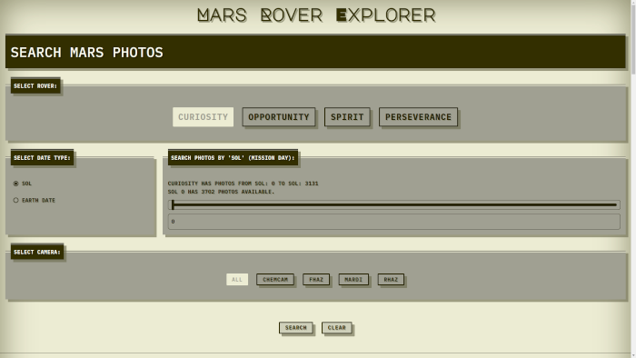
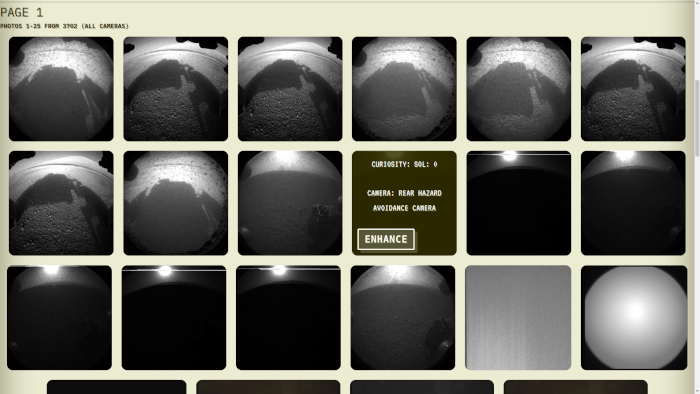
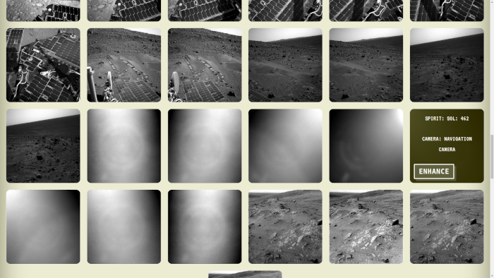
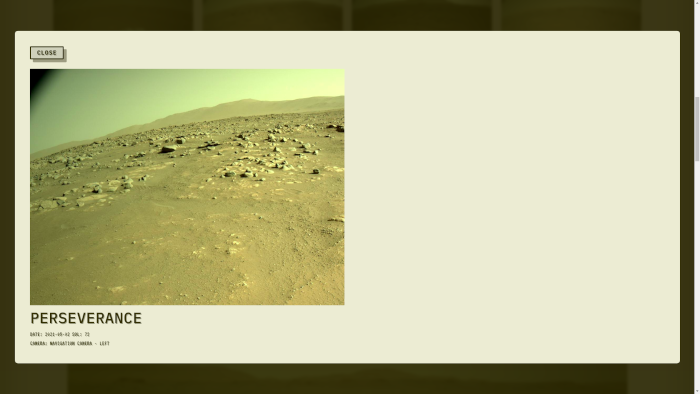

# 'Mars Rover Explorer'

## [live-version](https://sleepy-taiga-08469.herokuapp.com/api)

## API documentation

### Resources in the REST API

#### Rovers

- Information about each rover.

#### Photos

- Photos taken by rover by earth date or sol.

#### Manifests

- Data about each rover's photo collection.

### Endpoints available

#### /rovers/{rover-name}

##### Actions

- `GET /rovers/{rover-name}`

  - Response:
    - Information about the rover including status, photos taken and cameras available.

#### /rovers/{rover-name}/photos

##### Actions

- `GET /rovers/{rover-name}/photos`

  - Response:

    - Set of photos for given parameters.

  - Parameters

    | name       |  type   | description                                                                                                     |
    | :--------- | :-----: | :-------------------------------------------------------------------------------------------------------------- |
    | sol        | integer | (Required, either this or earth_date) ranges from 0 to max found in endpoint                                    |
    | earth_date | string  | (Required, either this or sol) Format YYYY-MM-DD                                                                |
    | camera     | string  | If rover doesn't have a camera it returns an error. Check rovers info at /rovers/{rover-name} for it's cameras. |
    | page       | integer | 25 per page returned                                                                                            |

#### /rovers/{rover-name}/manifest

##### Actions

- `GET /rovers/{rover-name}/manifest`

  - Response:

    - A lot of data about photos for each mission day.

## Server Built with

This project was made with Express

## Enviroment Variables Needed to run/deploy
Add a '.env' file with the following valiables:
- PORT: *port to run api locally*
- NODE_ENV: *production, test, or development*
- CLIENT_ORIGIN: *client's origin for CORS validation*
- NASA_TOKEN: *token obtained from https://api.nasa.gov/*
- NASA_BASEPATH: *https://api.nasa.gov/mars-photos/api/v1*

-------

# Client INFO
## [Live App](https://rover-explorer.vercel.app/).

## Description

'Mars Rover Explorer' Let's you explore Mars' terrain through the lenses of the Rovers living in the Red Planet.

## Further goals for this project

There are still a few kinks a have to fix. I would like to incorporate a user account to offer further functionality like saving favorites. I would also like to spend more time on the CSS.

## Screenshots

- Search Panel

- Photo set

- Browse Photos

- View photos in detail

## Summary

There are still a few kinks a have to fix. I would like to incorporate a user account to offer further functionality like saving favorites. I would also like to spend more time on the CSS.

## Built with

This project was made with React, Javascript and CSS.

